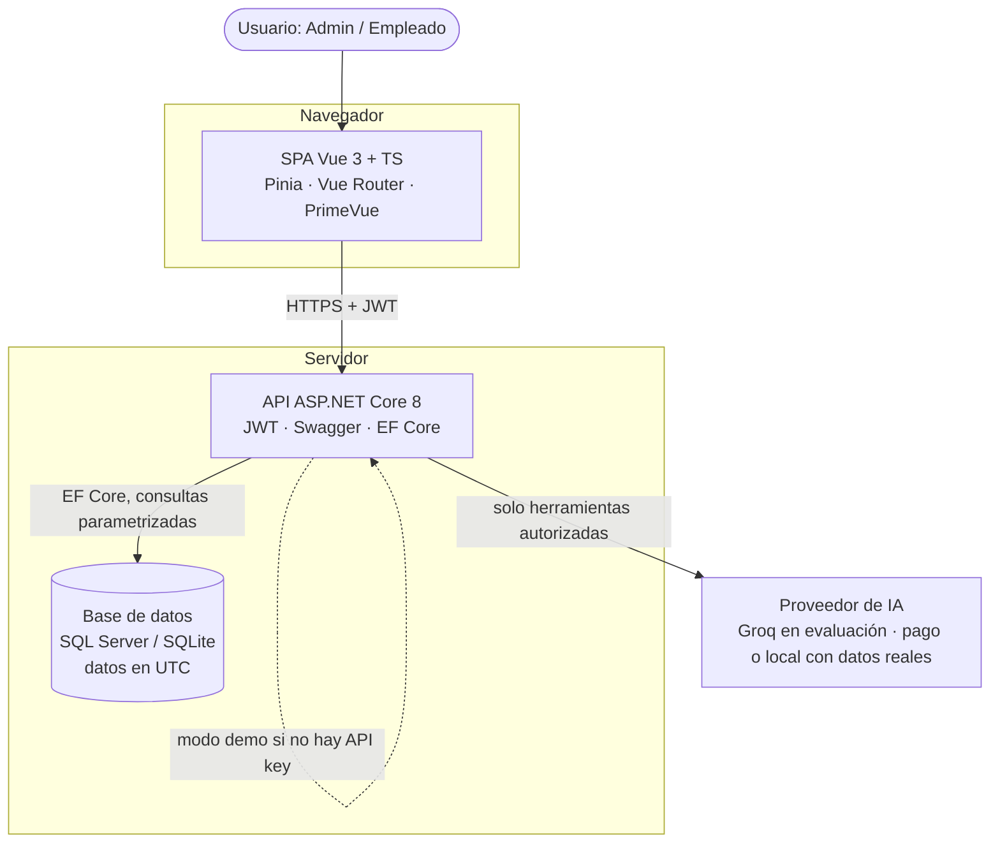
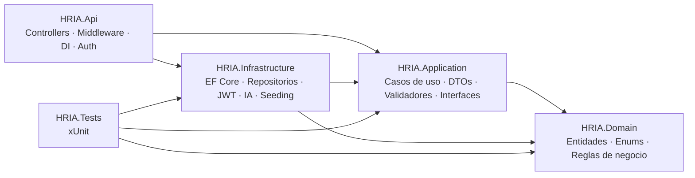
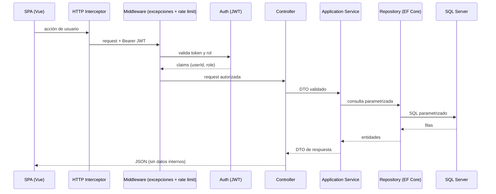
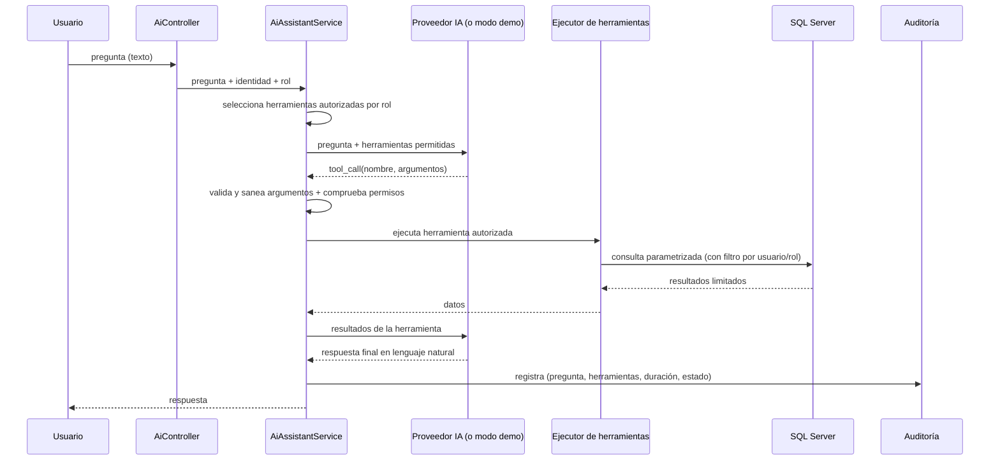
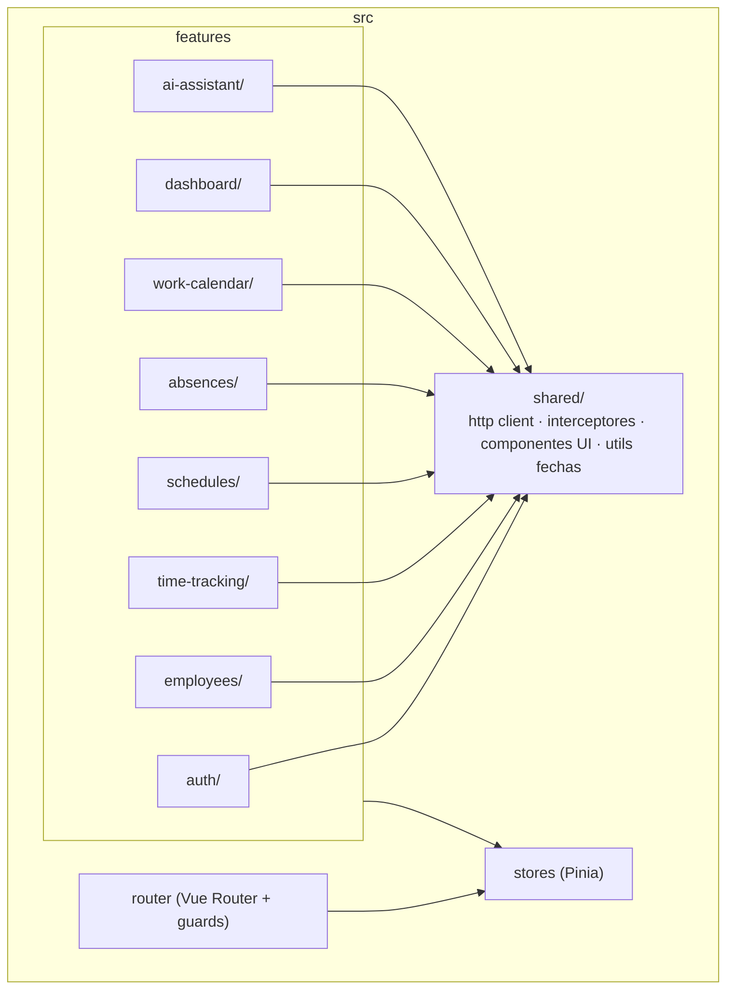

# BinsaRRHH — Arquitectura

## 1. Visión general

BinsaRRHH es una aplicación web de dos piezas desplegables independientemente:

- **Frontend SPA** (Vue 3 + TypeScript) compilado a estáticos y servido por cualquier host estático.
- **Backend API REST** (ASP.NET Core 8) con arquitectura **modular por capas** (inspiración Clean Architecture, sin sobre-ingeniería). Es un **monolito modular**, elegido frente a microservicios porque el problema no justifica la distribución; razonado en [ADR-007](./adr/ADR-007-monolito-modular-y-comunicacion-entre-servicios.md).
- **Base de datos**: SQL Server en producción; **SQLite** en desarrollo/demo (sin dependencias externas).
- **Proveedor de IA** externo accedido **solo** desde el backend mediante una abstracción, con **modo demo** cuando no hay API key. En evaluación se usa la **capa gratuita de Groq**, válida por tratarse de **datos ficticios**; con datos reales de plantilla se exige **suscripción de pago o inferencia local** ([ADR-006](./adr/ADR-006-proveedor-de-ia.md)).

### 1.1 Diagrama de contenedores (C4 nivel 2)

## 2. Arquitectura del backend (capas)

Solución `.sln` con cinco proyectos. Las dependencias apuntan **hacia dentro** (la infraestructura y la API dependen del dominio, nunca al revés).

### 2.1 Responsabilidad de cada capa

| Proyecto | Contiene | No contiene |
|----------|----------|-------------|
| **Domain** | Entidades (`Employee`, `Workday`, `Break`, `Schedule`, `AbsenceRequest`, `CalendarDay`…), enums (`Role`, `WorkdayStatus`, `AbsenceType`, `AbsenceStatus`), lógica de negocio pura (cálculo de horas, transiciones de estado del fichaje). | Referencias a EF Core, ASP.NET, ni nada de infraestructura. |
| **Application** | Interfaces de servicios y repositorios, DTOs, validadores (FluentValidation), servicios de caso de uso, contrato del proveedor de IA (`IAiAssistant`), definición de herramientas. | Implementaciones concretas de acceso a datos o proveedores externos. |
| **Infrastructure** | `DbContext` de EF Core, implementación de repositorios, generación/validación de JWT, hashing de contraseñas, clientes de IA (Claude / OpenAI) + modo demo, ejecución de herramientas, seeding. | Lógica de negocio de dominio; controladores. |
| **Api** | Controladores, middleware (excepciones, rate limiting), configuración de DI, CORS, Swagger, autenticación/autorización, `/health`. | Reglas de negocio (delega en Application/Domain). |
| **Tests** | Tests unitarios (reglas de negocio, autorización de herramientas IA) e integración ligera. | — |

> **Decisión (ADR-001):** se usa **arquitectura por capas pragmática**, no CQRS ni MediatR. Servicios de aplicación explícitos e inyectados. Motivo: el MVP no justifica la complejidad; prioriza legibilidad y velocidad de evaluación. Ver `docs/adr/`.

## 3. Flujo de una petición autenticada

## 4. Flujo del asistente de IA (function calling)

El modelo **nunca** ve la base de datos: solo recibe la definición de las herramientas que su rol permite y devuelve *qué* herramienta llamar con *qué* argumentos. El backend valida, ejecuta la consulta parametrizada y limita los resultados.

**Controles de seguridad del asistente:**
1. Selección de herramientas por rol antes de llamar al modelo.
2. Validación y saneamiento de argumentos (whitelist de valores, límites).
3. Filtro obligatorio por `employeeId` del usuario cuando el rol es Empleado (protección horizontal).
4. Sin SQL generado libremente: solo consultas predefinidas y parametrizadas.
5. Resultados acotados (top-N, sin campos sensibles).
6. Auditoría de cada consulta.
7. *Rate limiting* específico del endpoint de IA.

## 5. Arquitectura del frontend (por funcionalidades)

- **Cliente HTTP centralizado** con interceptores: añade el JWT, gestiona `401` (logout/redirect) y normaliza errores.
- **Guards de router** por rol y autenticación.
- **Estados** de carga, error y vacío consistentes.
- **Responsive** y accesibilidad básica.
- **El asistente no tiene ruta propia**: vive en una ventana flotante montada en el layout,
  accesible desde cualquier pantalla. Al estar fuera del `RouterView`, la conversación
  sobrevive a la navegación.

## 6. Stack tecnológico

| Capa | Tecnología | Versión objetivo | Motivo |
|------|-----------|------------------|--------|
| Frontend | Vue 3 + TypeScript + Vite | Vue 3.4+, Vite 5 | SPA moderna, tipado. |
| Estado | Pinia | 2.x | Store oficial de Vue 3. |
| Routing | Vue Router | 4.x | Guards por rol. |
| UI | PrimeVue (+ PrimeIcons) | 3.x/4.x | DataTable con paginación, formularios, diálogos, toasts y Chart listos. |
| Test front | Vitest | 1.x | Integración nativa con Vite. |
| Backend | ASP.NET Core Web API | .NET 8 LTS | Estabilidad y soporte largo. |
| ORM | Entity Framework Core | 8.x | Consultas parametrizadas, migraciones. |
| BD | SQL Server (prod) / SQLite (dev) | 2022 / 3.x | SQL Server según el enunciado; SQLite permite ejecutar sin dependencias externas. |
| Auth | JWT Bearer | — | Sin estado, estándar. |
| Docs API | Swagger / Swashbuckle | 6.x | OpenAPI. |
| Validación | FluentValidation | 11.x | Validadores expresivos. |
| Test back | xUnit | 2.x | Estándar .NET. |
| IA | **Groq** (capa gratuita) en evaluación | — | Tras abstracción `IAiAssistant`. Intercambiable por Claude u OpenAI vía `Ai:Provider`. **Con datos reales: pago o local** ([ADR-006](./adr/ADR-006-proveedor-de-ia.md)). |
| CI/CD | GitHub Actions | — | Build + test (backend y frontend). |

> **Sustituciones respecto al enunciado:** ninguna obligatoria. Se elige **PrimeVue** como "librería moderna compatible con Vue" y **FluentValidation** como apoyo (ambas dentro de lo permitido). Justificado en ADR.

## 7. Registros de decisión (ADR)

Las decisiones arquitectónicas se documentan en `docs/adr/` (formato ligero: contexto, decisión, consecuencias). ADRs previstas:

- **ADR-001** — Capas pragmáticas en lugar de CQRS/MediatR.
- **ADR-002** — .NET 8 LTS frente a 9/10.
- **ADR-003** — PrimeVue como librería de componentes.
- **ADR-004** — Abstracción `IAiAssistant` + modo demo para desacoplar del proveedor de IA.
- **ADR-005** — Fechas en UTC en BD, conversión en presentación.
- **ADR-006** — Proveedor de IA según la naturaleza de los datos: capa gratuita solo con datos
  ficticios; **con datos reales de plantilla, suscripción de pago o inferencia local**.
  📄 [Redactada](./adr/ADR-006-proveedor-de-ia.md).
- **ADR-007** — Monolito modular frente a microservicios; comunicación síncrona con el proveedor
  de IA; **dónde entraría Outbox y event-driven** si el sistema creciera (notificación al aprobar
  una ausencia). 📄 [Redactada](./adr/ADR-007-monolito-modular-y-comunicacion-entre-servicios.md).
- **ADR-008** — Asistente por *tool use* directo sobre HTTP, **sin framework de IA** (LangChain):
  el caso RAG no aplica a datos estructurados. 📄 [Redactada](./adr/ADR-008-asistente-sin-framework-de-ia.md).
- **ADR-009** — Despliegue directo en IIS, **sin contenedores ni Kubernetes**: sus ventajas
  (portabilidad cloud, escalado elástico, orquestación) no aplican al alcance.
  📄 [Redactada](./adr/ADR-009-despliegue-sin-contenedores.md).

## 8. Zona horaria

- La BD y la API trabajan **exclusivamente en UTC** para los *instantes* (fichajes, auditoría).
- El frontend convierte a la zona del usuario (navegador) al mostrar y envía UTC al backend.
- El cálculo de horas trabajadas es independiente de zona (diferencias de instantes).

**Excepción deliberada: los tramos de horario.** Un horario de 08:00 a 17:00 es una *hora de
reloj local del centro de trabajo*, no un instante. Guardarlo en UTC lo desplazaría una hora
con el cambio de estación, y el mismo horario significaría cosas distintas en enero y en julio.
Por eso los tramos se guardan como `TimeOnly` local (Europa/Madrid) y se comparan contra el
fichaje **después** de convertir este a la zona del centro.

> Al implementar la puntualidad del dashboard apareció un efecto de esto: restar dos `TimeOnly`
> nunca da negativo, envuelve por medianoche. Entrar cinco minutos antes de hora se contabilizaba
> como un retraso de casi 24 horas. La comparación se hace convirtiendo a `TimeSpan` primero.

## 9. Módulos funcionales

| Módulo | Backend | Frontend | Notas |
|--------|---------|----------|-------|
| Autenticación | `Auth/` | `features/auth/` | JWT, cambio y restablecimiento de contraseña |
| Empleados | `Employees/` | `features/employees/` | CRUD, baja lógica, filtros |
| Control horario | `TimeTracking/` | `features/time-tracking/` | Fichaje, reglas BR-01..BR-09 |
| Horarios | `Schedules/` | `features/schedules/` | Plantillas y asignación; previsión y desviación |
| Ausencias | `Absences/` | `features/absences/` | Solicitud, resolución, saldo, calendario anual |
| Calendario laboral | `WorkCalendar/` | `features/work-calendar/` | Festivos y fines de semana, rejilla de 12 meses |
| Dashboard | `Dashboard/` | `features/dashboard/` | Indicadores, cuatro gráficos, previsión de ausencias |
| Asistente | `Ai/` | `features/ai-assistant/` | Herramientas por rol; ventana flotante |
| Auditoría | `Audit/` | `features/audit/` | Acciones sensibles y consultas de IA |
