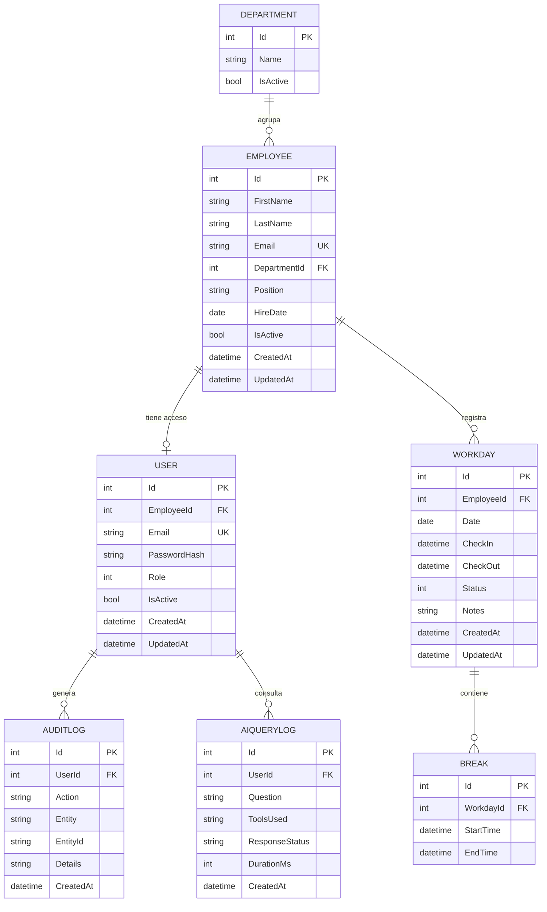

# BinsaRRHH — Modelo de datos

Todas las marcas temporales se almacenan en **UTC** (`datetime2` en SQL Server). Las cadenas usan longitudes acotadas. Las bajas son **lógicas** (`IsActive`), no borrados físicos.

## 1. Diagrama entidad-relación



## 2. Entidades

### 2.1 Department
| Campo | Tipo | Restricciones |
|-------|------|---------------|
| Id | int | PK, identity |
| Name | string(100) | requerido, único |
| IsActive | bool | por defecto `true` |

### 2.2 Employee
| Campo | Tipo | Restricciones |
|-------|------|---------------|
| Id | int | PK, identity |
| FirstName | string(80) | requerido |
| LastName | string(80) | requerido |
| Email | string(160) | requerido, **único** |
| DepartmentId | int | FK → Department, requerido |
| Position | string(100) | requerido |
| HireDate | date | requerido |
| IsActive | bool | por defecto `true` |
| CreatedAt | datetime2 (UTC) | auto |
| UpdatedAt | datetime2 (UTC) | auto |

### 2.3 User
> Incluye `AvatarUrl` (string(500), opcional): imagen de perfil del usuario. Si es nula, la
> interfaz genera un avatar con las iniciales y un **color derivado del nombre**, de modo que
> cada persona se distingue de un vistazo en listados y calendarios.

| Campo | Tipo | Restricciones |
|-------|------|---------------|
| Id | int | PK, identity |
| EmployeeId | int | FK → Employee, único (1:1) |
| Email | string(160) | requerido, **único** (coincide con el del empleado) |
| PasswordHash | string(256) | requerido; hash + sal (nunca texto plano) |
| Role | int (enum `Role`) | requerido |
| IsActive | bool | por defecto `true` |
| CreatedAt | datetime2 (UTC) | auto |
| UpdatedAt | datetime2 (UTC) | auto |

### 2.4 Workday
| Campo | Tipo | Restricciones |
|-------|------|---------------|
| Id | int | PK, identity |
| EmployeeId | int | FK → Employee, requerido |
| Date | date | día de la jornada (derivado de CheckIn en UTC) |
| CheckIn | datetime2 (UTC) | requerido |
| CheckOut | datetime2 (UTC) | nullable (null = jornada abierta) |
| Status | int (enum `WorkdayStatus`) | requerido |
| Notes | string(500) | opcional |
| CreatedAt | datetime2 (UTC) | auto |
| UpdatedAt | datetime2 (UTC) | auto |

**Índice único filtrado:** a lo sumo **una** jornada abierta por empleado (`EmployeeId` donde `CheckOut IS NULL`) → refuerza BR-01/BR-06 a nivel de BD.

### 2.5 Break
| Campo | Tipo | Restricciones |
|-------|------|---------------|
| Id | int | PK, identity |
| WorkdayId | int | FK → Workday, requerido |
| StartTime | datetime2 (UTC) | requerido |
| EndTime | datetime2 (UTC) | nullable (null = descanso abierto) |

**Regla:** a lo sumo un descanso abierto por jornada (BR-03), reforzado en lógica de dominio.

### 2.6 AuditLog
| Campo | Tipo | Restricciones |
|-------|------|---------------|
| Id | int | PK, identity |
| UserId | int | FK → User, requerido |
| Action | string(80) | p. ej. `Login`, `CreateEmployee`, `DeactivateEmployee` |
| Entity | string(80) | entidad afectada |
| EntityId | string(64) | id de la entidad afectada (string por flexibilidad) |
| Details | string(1000) | resumen **sin datos sensibles** |
| CreatedAt | datetime2 (UTC) | auto |

### 2.7 AiQueryLog
| Campo | Tipo | Restricciones |
|-------|------|---------------|
| Id | int | PK, identity |
| UserId | int | FK → User, requerido |
| Question | string(1000) | pregunta del usuario (saneada) |
| ToolsUsed | string(256) | lista de herramientas ejecutadas |
| ResponseStatus | string(40) | `Success` / `Denied` / `ProviderError` / `Demo` |
| DurationMs | int | duración total |
| CreatedAt | datetime2 (UTC) | auto |

### 2.8 Schedule (plantilla de horario)
| Campo | Tipo | Restricciones |
|-------|------|---------------|
| Id | int | PK, identity |
| Name | string(100) | **único**, requerido |
| Description | string(300) | opcional |
| IsActive | bit | baja lógica |
| CreatedAt / UpdatedAt | datetime2 (UTC) | auto |

### 2.9 ScheduleSlot (tramo)
| Campo | Tipo | Restricciones |
|-------|------|---------------|
| Id | int | PK, identity |
| ScheduleId | int | FK → Schedule, cascade |
| DayOfWeek | int | 0 = domingo … 6 = sábado |
| StartTime / EndTime | time | **horas locales del centro**, no UTC |

> Fin posterior al inicio, y sin solapamientos dentro del mismo día. Ninguna de las dos
> reglas se puede expresar como restricción de base de datos: se validan en el servicio.

### 2.10 ScheduleAssignment (asignación)
| Campo | Tipo | Restricciones |
|-------|------|---------------|
| Id | int | PK, identity |
| ScheduleId | int | FK → Schedule, restrict |
| EmployeeId | int | FK → Employee, restrict |
| StartDate | date | requerido |
| EndDate | date | **nulo = indefinido** |

> Un empleado no puede tener dos asignaciones solapadas. Tampoco es expresable con un índice
> único (implica comparar rangos), así que se valida en el servicio; el índice
> `(EmployeeId, StartDate)` acelera esa consulta.

### 2.11 AbsenceType (catálogo)
| Campo | Tipo | Restricciones |
|-------|------|---------------|
| Id | int | PK, identity |
| Code | string(40) | **único** (`VACACIONES`, `ENFERMEDAD`…) |
| Name | string(100) | requerido |
| ConsumesVacationBalance | bit | si es cierto, descuenta del saldo anual |
| RequiresApproval | bit | si es falso, la solicitud nace aprobada |
| ColorHex | string(7) | color en el calendario y en los gráficos |
| IsActive | bit | |

> Es **catálogo maestro**, no dato de demostración: viaja en la migración (`HasData`), porque
> en producción el seeder está desactivado y sin tipos el módulo no funciona.

> **Los colores están validados, no elegidos a ojo.** Se comprobaron con un validador de
> paletas (banda de luminosidad, saturación mínima, separación bajo daltonismo protan/deutan/
> tritan y contraste sobre el fondo) en modo claro y oscuro. La paleta inicial fallaba: verde y
> rojo quedaban a ΔE 6,6 bajo deuteranopía y el gris no alcanzaba el mínimo de saturación.
> El **orden de la lista importa**: azul y violeta no pueden quedar contiguos porque en modo
> oscuro son indistinguibles (ΔE 1,9).

### 2.12 AbsenceRequest (solicitud)
| Campo | Tipo | Restricciones |
|-------|------|---------------|
| Id | int | PK, identity |
| EmployeeId | int | FK → Employee, restrict |
| AbsenceTypeId | int | FK → AbsenceType, restrict |
| StartDate / EndDate | date | ambas inclusive |
| WorkingDays | decimal(5,2) | días laborables consumidos |
| Status | int | `AbsenceStatus` |
| Reason | string(500) | motivo del empleado |
| RequestedAt | datetime2 (UTC) | |
| DecidedAt | datetime2 (UTC) | nulo mientras esté pendiente |
| DecidedByUserId | int | FK → User, nulo |
| DecisionComment | string(500) | |

> `WorkingDays` se **guarda calculado** en el momento de solicitar. El horario del empleado
> puede cambiar después y el saldo ya consumido no debe moverse retroactivamente.

### 2.13 VacationAllowance (saldo anual)
| Campo | Tipo | Restricciones |
|-------|------|---------------|
| Id | int | PK, identity |
| EmployeeId | int | FK → Employee, restrict |
| Year | int | **único junto a EmployeeId** |
| Days | decimal(5,2) | decimal para admitir medias jornadas |

### 2.14 WorkCalendar (calendario laboral)
| Campo | Tipo | Restricciones |
|-------|------|---------------|
| Id | int | PK, identity |
| Year | int | **único** |
| Name | string(100) | requerido |
| NonWorkingWeekDaysMask | int | máscara de bits: bit N = `DayOfWeek` N |
| IsActive | bit | |

> Los días no laborables se guardan como máscara y no como tabla aparte: son siempre 7
> valores fijos y evita una unión en cada cálculo. No se pueden marcar los siete.

### 2.15 Holiday (festivo)
| Campo | Tipo | Restricciones |
|-------|------|---------------|
| Id | int | PK, identity |
| WorkCalendarId | int | FK → WorkCalendar, cascade |
| Date | date | **único dentro del calendario**, debe caer en su año |
| Name | string(120) | requerido |
| Kind | int | `HolidayKind` |

## 3. Enumeraciones

```csharp
public enum Role { Admin = 1, Employee = 2 }

public enum WorkdayStatus
{
    Open = 1,        // entrada registrada, sin salida
    Completed = 2,   // entrada y salida correctas
    Incomplete = 3   // cerrada sin salida válida (BR-08)
}

public enum AbsenceStatus
{
    Pending = 1,     // solicitada, pendiente de decisión
    Approved = 2,
    Rejected = 3,
    Cancelled = 4    // retirada por el propio empleado
}

public enum HolidayKind
{
    Nacional = 1,
    Autonomico = 2,
    Local = 3,
    Convenio = 4,    // día de descanso pactado en convenio
    Empresa = 5      // cierre de la empresa
}
```

> El descanso no necesita enum: `EndTime == null` indica descanso abierto.

### ¿Cuándo es laborable una fecha?

Se cumplen las **tres** condiciones a la vez:

1. No es día de la semana no laborable según el calendario del año.
2. No es festivo de ese calendario.
3. El horario asignado al empleado tiene tramos ese día.

Así, alguien a media jornada de lunes a miércoles no consume días de vacaciones por un jueves.

## 4. Relaciones y borrado

| Relación | Cardinalidad | On delete |
|----------|-------------|-----------|
| Department → Employee | 1 : N | Restrict (no borrar departamento con empleados) |
| Employee → User | 1 : 0..1 | Cascade lógico (baja de empleado desactiva usuario) |
| Employee → Workday | 1 : N | Restrict (histórico se conserva) |
| Workday → Break | 1 : N | Cascade |
| User → AuditLog / AiQueryLog | 1 : N | Restrict |
| Schedule → ScheduleSlot | 1 : N | Cascade (los tramos no viven sin su horario) |
| Schedule → ScheduleAssignment | 1 : N | Restrict (histórico se conserva) |
| Employee → ScheduleAssignment | 1 : N | Restrict |
| Employee → AbsenceRequest | 1 : N | Restrict |
| AbsenceType → AbsenceRequest | 1 : N | Restrict |
| Employee → VacationAllowance | 1 : N | Restrict |
| WorkCalendar → Holiday | 1 : N | Cascade |

> No se usan borrados físicos en el MVP; la baja es lógica vía `IsActive`.

## 5. Datos de demostración (seeding)

- **Departamentos:** Desarrollo, RR. HH., Ventas, Operaciones.
- **Empleados:** 8–12 ficticios repartidos entre departamentos.
- **Usuarios de acceso demo:**
  - `admin@hria.local` / `Demo1234!` → Rol Admin.
  - `empleado@hria.local` / `Demo1234!` → Rol Employee.
- **Jornadas de ejemplo:** completas (varios días), incompletas (BR-08), con empleados **trabajando ahora** (jornada abierta) y **en descanso** (descanso abierto), para que el dashboard y el asistente muestren datos reales.

> Las credenciales demo **solo** se aplican en el entorno demo/desarrollo.

## 6. Consideraciones de integridad

- `Email` único en `Employee` y `User`.
- Índice único filtrado de jornada abierta por empleado.
- Longitudes de cadena acotadas para evitar abuso.
- Todas las fechas en UTC; la `Date` de la jornada se deriva de `CheckIn` en UTC.
